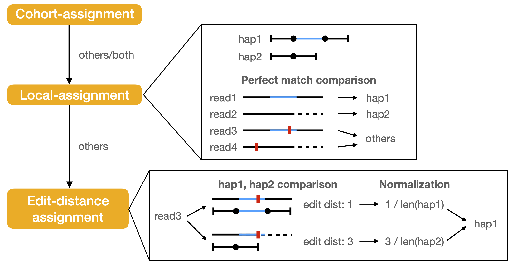

## Context-aware assignment algorithm
This method works by searching for the REF and ALT alleles, together with some of their flanking sequence, within the sequences of all the reads that aligned overlapping the variant.
Details were shown in the [paper](https://genomebiology.biomedcentral.com/articles/10.1186/s13059-024-03240-8).

### Cohort assignment
Variants appearing within a short distance (default: 25 bp) together into a “cohort.”  The cohorts are compared in the same style of local assignment.

### Local assignment
The read sequence is compared to `hap1` and `hap2` alleles of each variant.  To account for discripancies between read alignment and VCF representation, multiple anchor points are tested  (see Fig. 7 in the [paper](https://genomebiology.biomedcentral.com/articles/10.1186/s13059-024-03240-8)).  If a read perfectly matches to one of `hap1` or `hap2`, it is assigned accordingly.
If the read matches to both `hap1` and `hap2`, a situation commonly observed in short tandem repeats, the read is assigned as `both`.
Reads that do not perfectly match to either `hap1` or `hap2` under any anchor point are categorized as `others`.

As shown in the pipeline figure example, the variant is an insertion.  The `hap1` sequence includes the inserted segment along with 5 bp of flanking sequence on both sides, while `hap2` consists of only the flanking sequences without the insertion.
Read1 and read2 can be successfully assigned, whereas read3 and read4 are categorized as `others` due to sequencing error.

### Edit-distance assignment
Starting from biastools v0.3.0, an additional edit-distance assignment step is introduced to mitigate the impact of sequencing errors on reads previously categorized as ``others`` in the first two stages.
As shown in the figure, the edit distance between read3 and `hap1` is computed (value: 1) as well as the distance to `hap2` (value: 3).  The edit-distances are then normalized
by dividing by the length of `hap1` (longer) `hap2` (shorter), respectively.  Since the normalized edit distance to `hap1` is shorter, read3 is assigned to hap1.

#### Conditions
By default, the edit-distance assignment is applied only when the following conditions are met:
1. The edit-distance between the read and the final assignned haplotype is less than or equal to 5.
2. The length of the gap is shorter than 20 bp.

These two conditions are selected based on empirical observations.
